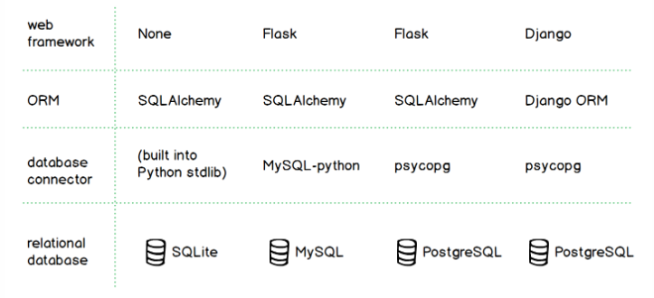

## Object Relational Mapper (ORM)
ORM is simply an object-oriented way of dealing with databases.
ORM is a code library that automates the transfer of data stored in a relational database,
tables into objects that are more commonly used in application code.

SQLALCHEMY and other ORMs are python-based Object Relational Mappepr
Which helps develoers commmunicate with SQL databases from python programs and
carry out basic SQL operators.
